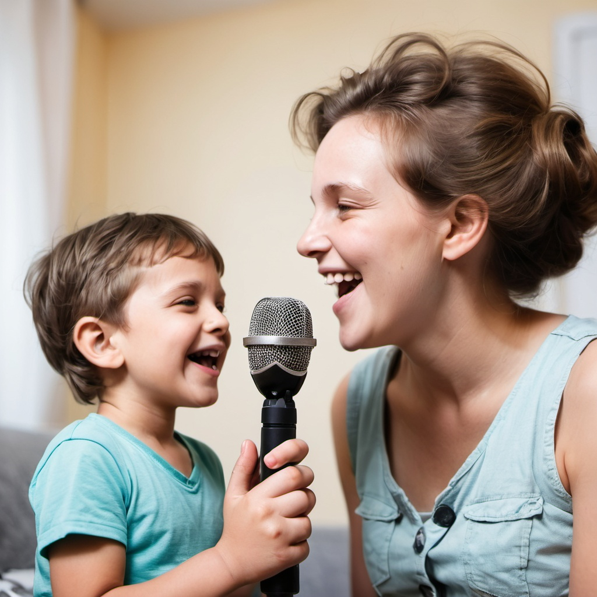

    preview do podcast

    <audio controls> 
        <source src="output/Podcast_apraxia.mp3" type="audio/mp3">
    </audio>

# Projeto Podcast Gerado por I.A.s

 > ℹ️ **NOTE:** Este é o repositório desenvolvido para o projeto do Bootcamp da DIO "CAIXA - IA Generativa com Microsoft Copilot"

Projeto com o objetivo de gerar um podcast utilizando ferramentas de IA através de prompts mais trabalhado.

Utilizer uma esteira de prompts para gerar cada etapa do processo criativo.

## 💻 Tecnologias utilizadas no projeto

- [ChatGPT](https://chat.openai.com/) 
- [Openart](https://openart.ai/)
- [ElevenLabs](https://beta.elevenlabs.io/)

## ✨ Como foi feito ?

- Roteiro gerado via chatgpt
- Audio gerado pela elevenLabs
- Openart capas

